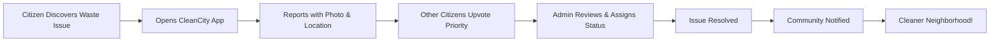

# 🌱 CleanCity
### *Community-Powered Waste Management & Environmental Awareness Platform*

<div align="center">

[](https://react.dev/)
[](https://supabase.com/)
[](https://vitejs.dev/)
[](https://tailwindcss.com/)

**Empowering communities to map, report, and resolve waste management issues in real-time**

[🚀 Quick Start](#-quick-start-guide) • [📖 Documentation](#-documentation) • [🎯 Features](#-core-features) • [🤝 Contributing](#-contributing)

</div>

---

## 📌 Table of Contents

<details>
<summary>Click to expand</summary>

1. [Vision & Mission](#-vision--mission)
2. [Problem Statement](#-the-problem-we-solve)
3. [Our Solution](#-our-solution)
4. [Core Features](#-core-features)
5. [Technology Stack](#-technology-stack)
6. [System Architecture](#-system-architecture)
7. [Quick Start Guide](#-quick-start-guide)
8. [Detailed Setup](#-detailed-setup-instructions)
9. [Database Schema](#-database-schema)
10. [User Roles & Permissions](#-user-roles--permissions)
11. [API Reference](#-api-reference)
12. [Deployment Guide](#-deployment-guide)
13. [Best Practices](#-best-practices)
14. [Troubleshooting](#-troubleshooting)
15. [Roadmap](#-roadmap)
16. [Contributing](#-contributing)
17. [License](#-license)

</details>

---

## 🌍 Vision & Mission

### Vision
*A cleaner, healthier planet through community-driven environmental action and awareness.*

### Mission
We're building a **democratic waste management platform** that:
- **Empowers** citizens to report and track waste issues
- **Connects** communities with local recycling resources
- **Drives** municipal accountability through data transparency
- **Educates** people about sustainable waste practices
- **Transforms** neighborhoods into cleaner, greener spaces

---

## 🔍 The Problem We Solve

### Urban Waste Challenges

| Challenge | Impact | CleanCity Solution |
|-----------|--------|-------------------|
| **Invisible Issues** | Waste problems go unreported and unresolved | Real-time crowdsourced reporting with geolocation |
| **Communication Gap** | Citizens can't easily reach municipal authorities | Direct reporting channel with status tracking |
| **Lack of Accountability** | No transparency in waste management | Public dashboard with resolution metrics |
| **Poor Recycling Awareness** | Low recycling rates due to lack of information | Interactive map of recycling centers + education |
| **Community Fragmentation** | No collective action mechanism | Upvoting system to prioritize critical issues |

### By The Numbers
- **🗑️ 2.01 billion tons** of municipal solid waste generated annually worldwide
- **📈 70% increase** expected by 2050
- **♻️ Only 13.5%** of waste is recycled globally
- **🏙️ Cities** account for 80% of global greenhouse gas emissions

**CleanCity tackles these issues head-on with technology + community power.**

---

## 💡 Our Solution

### How CleanCity Works



### Three Pillars

#### 🗺️ **1. Interactive Waste Mapping**
Real-time visualization of waste issues across your city:
- **Geolocation-based** reporting
- **Color-coded markers** by issue type
- **Heat map** to identify problem zones
- **Cluster view** for dense urban areas

#### 📸 **2. Visual Evidence System**
Photos speak louder than words:
- **Camera integration** for instant capture
- **Image upload** from gallery
- **Before/after** documentation
- **Visual verification** for admins

#### 👥 **3. Community Engagement**
Democracy in action:
- **Upvote system** to prioritize urgent issues
- **Community statistics** to track impact
- **Gamification** (coming soon: points & badges)
- **Social sharing** to spread awareness

---

## 🎯 Core Features

### For Citizens

<table>
<tr>
<td width="50%">

#### 📍 Smart Reporting
- **Quick Report**: 3 taps to submit an issue
- **Auto-Location**: GPS-based pinpoint accuracy
- **4 Issue Types**: 
  - 🔶 Overflowing bins
  - 🔴 Illegal dumping
  - 🟡 Litter hotspots
  - 🟢 Recycling opportunities
- **Photo Attachment**: Visual proof in one click
- **Anonymous Option**: Report without account

</td>
<td width="50%">

#### 🗺️ Interactive Map View
- **Real-time Updates**: See issues as they're reported
- **Filter by Type**: Focus on specific problems
- **Cluster Markers**: Clean visualization in dense areas
- **Custom Icons**: Color-coded by severity
- **Location Search**: Find issues near you
- **Directions**: Navigate to problem sites

</td>
</tr>
<tr>
<td>

#### 👍 Community Voting
- **Upvote Issues**: Highlight urgent problems
- **See Trending**: Most-upvoted issues surface first
- **Impact Metrics**: Track community engagement
- **Leaderboard**: Top contributors (coming soon)

</td>
<td>

#### 📚 Education Hub
- **Waste Segregation Guide**:
  - 🟢 Wet Waste (Organic)
  - 🔵 Dry Waste (Recyclable)
  - 🔴 Hazardous Waste
- **Nearby Recycling Centers**: Find where to recycle
- **Operating Hours**: Know when centers are open
- **Accepted Materials**: What each center takes

</td>
</tr>
</table>

### For Administrators

<table>
<tr>
<td width="50%">

#### 🛡️ Admin Dashboard
- **All Reports Overview**: Centralized management
- **Status Tracking**: Pending → In Progress → Resolved
- **Batch Actions**: Handle multiple reports
- **Priority Queue**: Sort by upvotes
- **Search & Filter**: Advanced queries
- **Export Data**: CSV download for analysis

</td>
<td width="50%">

#### 📊 Analytics & Insights
- **Real-time Statistics**:
  - Total reports count
  - Resolution rate %
  - Average response time
  - Active users
- **Type Breakdown**: Issue distribution
- **Trend Analysis**: Patterns over time
- **Hotspot Identification**: Problem areas
- **Performance Metrics**: Admin efficiency

</td>
</tr>
</table>

---

## 🛠️ Technology Stack

### Frontend Architecture

```
┌─────────────────────────────────────────────────────┐
│                   User Interface                    │
│  ┌──────────────────────────────────────────────┐   │
│  │         React 19 (Concurrent Mode)           │   │
│  │  • useState, useEffect, useContext Hooks     │   │
│  │  • Component-based Architecture              │   │
│  │  • Optimized Re-rendering                    │   │
│  └──────────────────────────────────────────────┘   │
└─────────────────────────────────────────────────────┘
                        │
                        ▼
┌─────────────────────────────────────────────────────┐
│                 Styling Layer                       │
│  ┌──────────────────────────────────────────────┐   │
│  │         Tailwind CSS 3.4                     │   │
│  │  • Utility-first Styling                     │   │
│  │  • Responsive Design                         │   │
│  │  • Custom Theme Configuration                │   │
│  │  • Dark Mode Support (planned)               │   │
│  └──────────────────────────────────────────────┘   │
└─────────────────────────────────────────────────────┘
                        │
                        ▼
┌─────────────────────────────────────────────────────┐
│              Mapping & Location                     │
│  ┌──────────────────────────────────────────────┐   │
│  │    Leaflet 1.9 + React-Leaflet 5.0           │   │
│  │  • OpenStreetMap Tiles                       │   │
│  │  • Custom Markers & Popups                   │   │
│  │  • Geolocation API Integration               │   │
│  │  • Circle Markers for Waste Points           │   │
│  └──────────────────────────────────────────────┘   │
└─────────────────────────────────────────────────────┘
                        │
                        ▼
┌─────────────────────────────────────────────────────┐
│             Backend & Database                      │
│  ┌──────────────────────────────────────────────┐   │
│  │         Supabase (BaaS Platform)             │   │
│  │  • PostgreSQL Database                       │   │
│  │  • Row Level Security (RLS)                  │   │
│  │  • Real-time Subscriptions                   │   │
│  │  • Authentication & Authorization            │   │
│  │  • Storage for Images                        │   │
│  └──────────────────────────────────────────────┘   │
└─────────────────────────────────────────────────────┘
                        │
                        ▼
┌─────────────────────────────────────────────────────┐
│             Build & Development                     │
│  ┌──────────────────────────────────────────────┐   │
│  │              Vite 7                          │   │
│  │  • Lightning-fast HMR                        │   │
│  │  • Optimized Production Builds               │   │
│  │  • ES Modules Native                         │   │
│  │  • Plugin Ecosystem                          │   │
│  └──────────────────────────────────────────────┘   │
└─────────────────────────────────────────────────────┘
```

### Complete Tech Breakdown

| Category | Technology | Version | Purpose |
|----------|-----------|---------|---------|
| **Frontend Framework** | React | 19.2.0 | UI component library |
| **Build Tool** | Vite | 7.2.4 | Development server & bundler |
| **Styling** | Tailwind CSS | 3.4.17 | Utility-first CSS framework |
| **Database** | Supabase (PostgreSQL) | Latest | Real-time database & auth |
| **Authentication** | Supabase Auth | Latest | User authentication system |
| **Storage** | Supabase Storage | Latest | Image hosting |
| **Maps** | Leaflet | 1.9.4 | Interactive mapping |
| **React Maps** | React-Leaflet | 5.0.0 | React wrapper for Leaflet |
| **Icons** | Lucide React | Latest | Beautiful icon library |
| **Linting** | ESLint | 9.39.1 | Code quality & standards |
| **Deployment** | Netlify | - | Hosting & CI/CD |

### Why These Technologies?

#### ✅ React 19
- **Concurrent rendering** for smooth UX
- **Server Components** ready (future upgrade)
- **Automatic batching** for better performance
- **Rich ecosystem** with extensive libraries

#### ✅ Supabase
- **PostgreSQL** = powerful relational database
- **Row-level security** = built-in authorization
- **Real-time** = instant updates across clients
- **Open source** = no vendor lock-in
- **Generous free tier** = perfect for MVPs

#### ✅ Vite
- **10-100x faster** than Webpack
- **Native ESM** = no bundling in dev
- **Hot Module Replacement** = instant feedback
- **Optimized builds** = smaller bundle sizes

#### ✅ Tailwind CSS
- **Rapid development** = no context switching
- **Consistent design** = design system built-in
- **Responsive by default** = mobile-first approach
- **Tree-shaking** = unused CSS removed

---

## 🏗️ System Architecture

### High-Level Overview

```
                    ┌─────────────────┐
                    │   End Users     │
                    │  (Citizens &    │
                    │   Admins)       │
                    └────────┬────────┘
                             │
                             │ HTTPS
                             │
                    ┌────────▼────────┐
                    │   Netlify CDN   │
                    │  (Static Host)  │
                    └────────┬────────┘
                             │
                             │
              ┌──────────────┴──────────────┐
              │                             │
     ┌────────▼────────┐         ┌─────────▼──────────┐
     │  React SPA      │         │   Browser APIs     │
     │  • Components   │         │   • Geolocation    │
     │  • State Mgmt   │         │   • Camera         │
     │  • Routing      │         │   • LocalStorage   │
     └────────┬────────┘         └────────────────────┘
              │
              │ REST API / WebSocket
              │
     ┌────────▼─────────────────────────────────────┐
     │          Supabase Backend                    │
     │  ┌──────────────────────────────────────┐    │
     │  │        PostgreSQL Database           │    │
     │  │  • waste_reports                     │    │
     │  │  • recycling_centers                 │    │
     │  │  • user_profiles                     │    │
     │  └──────────────────────────────────────┘    │
     │  ┌──────────────────────────────────────┐    │
     │  │        Authentication                │    │
     │  │  • Email/Password                    │    │
     │  │  • OAuth (future)                    │    │
     │  │  • Role-based Access                 │    │
     │  └──────────────────────────────────────┘    │
     │  ┌──────────────────────────────────────┐    │
     │  │        Storage Buckets               │    │
     │  │  • waste-images/                     │    │
     │  │  • user-avatars/ (planned)           │    │
     │  └──────────────────────────────────────┘    │
     │  ┌──────────────────────────────────────┐    │
     │  │     Real-time Subscriptions          │    │
     │  │  • Live report updates               │    │
     │  │  • Status change notifications       │    │
     │  └──────────────────────────────────────┘    │
     └──────────────────────────────────────────────┘
```

### Data Flow Diagram

```
┌─────────────┐
│   Citizen   │
│  Sees Waste │
└──────┬──────┘
       │
       │ 1. Opens CleanCity
       │
┌──────▼──────────────────┐
│  Location Permission    │
│  Requested              │
└──────┬──────────────────┘
       │
       │ 2. Grant permission
       │
┌──────▼──────────────────┐
│  Opens Camera/Gallery   │
│  Takes Photo            │
└──────┬──────────────────┘
       │
       │ 3. Photo captured
       │
┌──────▼──────────────────┐
│  Upload to Supabase     │
│  Storage Bucket         │
└──────┬──────────────────┘
       │
       │ 4. Get public URL
       │
┌──────▼──────────────────┐
│  Submit Report Form     │
│  + Metadata             │
└──────┬──────────────────┘
       │
       │ 5. INSERT query
       │
┌──────▼──────────────────┐
│  PostgreSQL Database    │
│  waste_reports table    │
└──────┬──────────────────┘
       │
       │ 6. Real-time broadcast
       │
┌──────▼──────────────────┐
│  All Connected Clients  │
│  See New Report         │
└──────┬──────────────────┘
       │
       │ 7. Admin receives notification
       │
┌──────▼──────────────────┐
│  Admin Dashboard        │
│  Reviews & Updates      │
└──────┬──────────────────┘
       │
       │ 8. Status change UPDATE
       │
┌──────▼──────────────────┐
│  Database Updated       │
│  Citizens Notified      │
└─────────────────────────┘
```

---

## 🚀 Quick Start Guide

### Prerequisites Checklist

Before you begin, make sure you have:

- [x] **Node.js** v18.0.0+ installed ([Download](https://nodejs.org/))
- [x] **npm** v9.0.0+ or **yarn** v1.22.0+
- [x] **Git** installed ([Download](https://git-scm.com/))
- [x] A **Supabase account** ([Sign up free](https://supabase.com/))
- [x] A modern **web browser** (Chrome, Firefox, Edge, Safari)
- [x] A **code editor** (VS Code recommended)

### ⚡ 5-Minute Setup

```bash
# 1️⃣ Clone the repository
git clone https://github.com/Thiru-Selvam-06/City-Town-Waste-Mapping-Awareness-Platform.git
cd City-Town-Waste-Mapping-Awareness-Platform/frontend

# 2️⃣ Install dependencies
npm install

# 3️⃣ Set up environment variables
cp .env.example .env
# Edit .env with your Supabase credentials (see below)

# 4️⃣ Start development server
npm run dev

# 🎉 Open http://localhost:5173 in your browser
```

### 🔑 Environment Variables Setup

Create a `.env` file in the `frontend` directory:

```env
# Supabase Configuration
VITE_SUPABASE_URL=https://your-project-ref.supabase.co
VITE_SUPABASE_ANON_KEY=your-anon-key-here
```

**Where to find these values:**
1. Go to [supabase.com](https://supabase.com/) and create a new project
2. Navigate to: **Settings** → **API**
3. Copy the **Project URL** and **anon/public key**

---

## 📚 Detailed Setup Instructions

### Step 1: Supabase Project Setup

#### 1.1 Create a New Project

1. Visit [supabase.com](https://supabase.com/)
2. Click "Start your project"
3. Create organization (if first time)
4. Click "New Project"
5. Fill in:
   - **Name**: CleanCity (or your choice)
   - **Database Password**: Generate a strong password (save it!)
   - **Region**: Choose closest to your users
6. Click "Create new project" (takes ~2 minutes)

#### 1.2 Database Schema Setup

Navigate to **SQL Editor** in your Supabase dashboard and run these scripts:

**Table 1: waste_reports**
```sql
-- Create waste reports table
CREATE TABLE waste_reports (
    id UUID DEFAULT gen_random_uuid() PRIMARY KEY,
    created_at TIMESTAMP WITH TIME ZONE DEFAULT NOW(),
    updated_at TIMESTAMP WITH TIME ZONE DEFAULT NOW(),
    
    -- Report Details
    type TEXT NOT NULL CHECK (type IN ('overflowing', 'illegal-dump', 'litter', 'recycling')),
    description TEXT NOT NULL,
    status TEXT DEFAULT 'pending' CHECK (status IN ('pending', 'in-progress', 'resolved')),
    
    -- Location Data
    latitude DOUBLE PRECISION NOT NULL,
    longitude DOUBLE PRECISION NOT NULL,
    location_name TEXT,
    
    -- Media
    image_url TEXT,
    
    -- User & Engagement
    user_id UUID REFERENCES auth.users(id) ON DELETE SET NULL,
    upvotes INTEGER DEFAULT 0 CHECK (upvotes >= 0),
    
    -- Indexes for performance
    created_at_idx TIMESTAMP WITH TIME ZONE
);

-- Create indexes
CREATE INDEX idx_waste_reports_status ON waste_reports(status);
CREATE INDEX idx_waste_reports_type ON waste_reports(type);
CREATE INDEX idx_waste_reports_created_at ON waste_reports(created_at DESC);
CREATE INDEX idx_waste_reports_location ON waste_reports USING GIST (ll_to_earth(latitude, longitude));

-- Add trigger for updated_at
CREATE OR REPLACE FUNCTION update_updated_at_column()
RETURNS TRIGGER AS $$
BEGIN
    NEW.updated_at = NOW();
    RETURN NEW;
END;
$$ LANGUAGE plpgsql;

CREATE TRIGGER update_waste_reports_updated_at
    BEFORE UPDATE ON waste_reports
    FOR EACH ROW
    EXECUTE FUNCTION update_updated_at_column();
```

**Table 2: recycling_centers**
```sql
-- Create recycling centers table
CREATE TABLE recycling_centers (
    id UUID DEFAULT gen_random_uuid() PRIMARY KEY,
    created_at TIMESTAMP WITH TIME ZONE DEFAULT NOW(),
    
    -- Center Details
    name TEXT NOT NULL,
    address TEXT NOT NULL,
    hours TEXT NOT NULL,
    phone TEXT,
    
    -- Location
    latitude DOUBLE PRECISION NOT NULL,
    longitude DOUBLE PRECISION NOT NULL,
    
    -- Metadata
    accepts TEXT[] NOT NULL DEFAULT '{}', -- Array of accepted materials
    verified BOOLEAN DEFAULT false,
    
    -- Constraints
    CONSTRAINT valid_coordinates CHECK (
        latitude BETWEEN -90 AND 90 AND
        longitude BETWEEN -180 AND 180
    )
);

-- Create index for location queries
CREATE INDEX idx_recycling_centers_location 
    ON recycling_centers USING GIST (ll_to_earth(latitude, longitude));
```

**Table 3: user_profiles** (Optional - for enhanced features)
```sql
-- Create user profiles table
CREATE TABLE user_profiles (
    id UUID REFERENCES auth.users(id) ON DELETE CASCADE PRIMARY KEY,
    created_at TIMESTAMP WITH TIME ZONE DEFAULT NOW(),
    updated_at TIMESTAMP WITH TIME ZONE DEFAULT NOW(),
    
    -- Profile Info
    username TEXT UNIQUE,
    full_name TEXT,
    avatar_url TEXT,
    
    -- Stats
    reports_submitted INTEGER DEFAULT 0,
    points INTEGER DEFAULT 0,
    
    -- Role
    role TEXT DEFAULT 'citizen' CHECK (role IN ('citizen', 'admin', 'moderator'))
);

-- Trigger to create profile on user signup
CREATE OR REPLACE FUNCTION create_user_profile()
RETURNS TRIGGER AS $$
BEGIN
    INSERT INTO user_profiles (id, role)
    VALUES (NEW.id, 'citizen');
    RETURN NEW;
END;
$$ LANGUAGE plpgsql SECURITY DEFINER;

CREATE TRIGGER on_auth_user_created
    AFTER INSERT ON auth.users
    FOR EACH ROW
    EXECUTE FUNCTION create_user_profile();
```

#### 1.3 Row Level Security (RLS) Policies

**Enable RLS:**
```sql
-- Enable RLS on all tables
ALTER TABLE waste_reports ENABLE ROW LEVEL SECURITY;
ALTER TABLE recycling_centers ENABLE ROW LEVEL SECURITY;
ALTER TABLE user_profiles ENABLE ROW LEVEL SECURITY;
```

**Policies for waste_reports:**
```sql
-- Anyone can view reports
CREATE POLICY "Reports are viewable by everyone"
    ON waste_reports FOR SELECT
    USING (true);

-- Authenticated users can create reports
CREATE POLICY "Authenticated users can create reports"
    ON waste_reports FOR INSERT
    WITH CHECK (auth.role() = 'authenticated');

-- Users can update their own reports (first hour only)
CREATE POLICY "Users can update own reports within 1 hour"
    ON waste_reports FOR UPDATE
    USING (
        auth.uid() = user_id AND
        created_at > NOW() - INTERVAL '1 hour'
    );

-- Admins can update any report
CREATE POLICY "Admins can update any report"
    ON waste_reports FOR UPDATE
    USING (
        EXISTS (
            SELECT 1 FROM user_profiles
            WHERE id = auth.uid() AND role = 'admin'
        )
    );

-- Users can delete their own reports (first hour only)
CREATE POLICY "Users can delete own reports within 1 hour"
    ON waste_reports FOR DELETE
    USING (
        auth.uid() = user_id AND
        created_at > NOW() - INTERVAL '1 hour'
    );
```

**Policies for recycling_centers:**
```sql
-- Anyone can view recycling centers
CREATE POLICY "Centers are viewable by everyone"
    ON recycling_centers FOR SELECT
    USING (true);

-- Only admins can manage recycling centers
CREATE POLICY "Admins can manage recycling centers"
    ON recycling_centers FOR ALL
    USING (
        EXISTS (
            SELECT 1 FROM user_profiles
            WHERE id = auth.uid() AND role = 'admin'
        )
    );
```

**Policies for user_profiles:**
```sql
-- Users can view all profiles
CREATE POLICY "Profiles are viewable by everyone"
    ON user_profiles FOR SELECT
    USING (true);

-- Users can update their own profile
CREATE POLICY "Users can update own profile"
    ON user_profiles FOR UPDATE
    USING (auth.uid() = id);
```

#### 1.4 Storage Bucket Setup

1. Navigate to **Storage** in Supabase dashboard
2. Click "Create a new bucket"
3. Name: `waste-images`
4. Set as **Public bucket** ✅
5. Create the bucket

**Storage Policies:**
```sql
-- Allow anyone to view images
CREATE POLICY "Images are publicly accessible"
    ON storage.objects FOR SELECT
    USING (bucket_id = 'waste-images');

-- Allow authenticated users to upload images
CREATE POLICY "Authenticated users can upload images"
    ON storage.objects FOR INSERT
    WITH CHECK (
        bucket_id = 'waste-images' AND
        auth.role() = 'authenticated'
    );

-- Allow users to update their own uploads
CREATE POLICY "Users can update own uploads"
    ON storage.objects FOR UPDATE
    USING (
        bucket_id = 'waste-images' AND
        auth.uid()::text = (storage.foldername(name))[1]
    );

-- Allow users to delete their own uploads
CREATE POLICY "Users can delete own uploads"
    ON storage.objects FOR DELETE
    USING (
        bucket_id = 'waste-images' AND
        auth.uid()::text = (storage.foldername(name))[1]
    );
```

#### 1.5 Seed Sample Data (Optional)

```sql
-- Insert sample recycling centers
INSERT INTO recycling_centers (name, address, hours, latitude, longitude, accepts) VALUES
('Green Cycle Delhi', '15 Connaught Place, New Delhi', 'Mon-Sat: 9AM-6PM', 28.6315, 77.2167, ARRAY['paper', 'plastic', 'metal', 'glass']),
('EcoWaste Mumbai', '42 Marine Drive, Mumbai', 'Mon-Sun: 8AM-8PM', 18.9432, 72.8236, ARRAY['electronics', 'batteries', 'plastic']),
('RecycleHub Bangalore', 'MG Road, Bangalore', 'Mon-Fri: 10AM-5PM', 12.9716, 77.5946, ARRAY['paper', 'cardboard', 'plastic', 'metal']);
```

### Step 2: Frontend Installation

#### 2.1 Clone and Navigate

```bash
git clone https://github.com/Thiru-Selvam-06/City-Town-Waste-Mapping-Awareness-Platform.git
cd City-Town-Waste-Mapping-Awareness-Platform/frontend
```

#### 2.2 Install Dependencies

```bash
# Using npm
npm install

# Or using yarn
yarn install

# Or using pnpm (faster)
pnpm install
```

**Expected output:**
```
added 312 packages, and audited 313 packages in 45s

94 packages are looking for funding
  run `npm fund` for details

found 0 vulnerabilities
```

#### 2.3 Configure Environment

Create `.env` file:
```bash
# On Unix/Mac/Linux
touch .env

# On Windows
type nul > .env
```

Add your Supabase credentials:
```env
# Supabase Configuration
VITE_SUPABASE_URL=https://xxxxxxxxxxxxx.supabase.co
VITE_SUPABASE_ANON_KEY=eyJhbGciOiJIUzI1NiIsInR5cCI6IkpXVCJ9...
```

#### 2.4 Verify Setup

```bash
# Check Node version
node --version
# Should be v18.0.0 or higher

# Check npm version
npm --version
# Should be v9.0.0 or higher

# Test environment variables
npm run dev
```

If everything is correct, you'll see:
```
VITE v7.2.4  ready in 423 ms

➜  Local:   http://localhost:5173/
➜  Network: use --host to expose
➜  press h + enter to show help
```

### Step 3: Create First Admin User

#### 3.1 Sign Up via UI

1. Open http://localhost:5173
2. Click "Sign In"
3. Click "Sign Up"
4. Enter email and password
5. Check email for confirmation link
6. Click confirmation link

#### 3.2 Grant Admin Role

In Supabase SQL Editor:
```sql
-- Replace 'your-email@example.com' with your actual email
UPDATE user_profiles
SET role = 'admin'
WHERE id = (
    SELECT id FROM auth.users WHERE email = 'your-email@example.com'
);
```

#### 3.3 Verify Admin Access

1. Refresh the CleanCity app
2. You should now see an "Admin" button in the header
3. Click it to access the admin dashboard

---

## 📊 Database Schema

### Entity Relationship Diagram

```
┌─────────────────────────────────────────────────────────┐
│                    auth.users (Supabase)                │
│  ─────────────────────────────────────────────────────  │
│  • id (UUID, PK)                                        │
│  • email (TEXT, UNIQUE)                                 │
│  • encrypted_password (TEXT)                            │
│  • created_at (TIMESTAMP)                               │
└───────────────────────┬─────────────────────────────────┘
                        │
                        │ 1:1
                        │
┌───────────────────────▼─────────────────────────────────┐
│                    user_profiles                        │
│  ─────────────────────────────────────────────────────  │
│  • id (UUID, PK, FK → auth.users)                       │
│  • username (TEXT, UNIQUE)                              │
│  • full_name (TEXT)                                     │
│  • avatar_url (TEXT)                                    │
│  • role (TEXT) [citizen, admin, moderator]              │
│  • reports_submitted (INT)                              │
│  • points (INT)                                         │
│  • created_at (TIMESTAMP)                               │
└───────────────────────┬─────────────────────────────────┘
                        │
                        │ 1:N
                        │
┌───────────────────────▼─────────────────────────────────┐
│                    waste_reports                        │
│  ─────────────────────────────────────────────────────  │
│  • id (UUID, PK)                                        │
│  • type (TEXT) [overflowing, illegal-dump, litter,      │
│                 recycling]                              │
│  • description (TEXT)                                   │
│  • status (TEXT) [pending, in-progress, resolved]       │
│  • latitude (DOUBLE PRECISION)                          │
│  • longitude (DOUBLE PRECISION)                         │
│  • location_name (TEXT)                                 │
│  • image_url (TEXT)                                     │
│  • user_id (UUID, FK → auth.users, nullable)            │
│  • upvotes (INT, default 0)                             │
│  • created_at (TIMESTAMP)                               │
│  • updated_at (TIMESTAMP)                               │
└─────────────────────────────────────────────────────────┘

┌─────────────────────────────────────────────────────────┐
│                  recycling_centers                      │
│  ─────────────────────────────────────────────────────  │
│  • id (UUID, PK)                                        │
│  • name (TEXT)                                          │
│  • address (TEXT)                                       │
│  • hours (TEXT)                                         │
│  • phone (TEXT)                                         │
│  • latitude (DOUBLE PRECISION)                          │
│  • longitude (DOUBLE PRECISION)                         │
│  • accepts (TEXT[]) -- Array of materials               │
│  • verified (BOOLEAN)                                   │
│  • created_at (TIMESTAMP)                               │
└─────────────────────────────────────────────────────────┘
```

### Field Descriptions

#### waste_reports Table

| Field | Type | Constraints | Description |
|-------|------|-------------|-------------|
| `id` | UUID | PRIMARY KEY | Auto-generated unique identifier |
| `type` | TEXT | NOT NULL, CHECK | Issue type: overflowing, illegal-dump, litter, recycling |
| `description` | TEXT | NOT NULL | Detailed description from reporter |
| `status` | TEXT | CHECK | Current status: pending, in-progress, resolved |
| `latitude` | DOUBLE PRECISION | NOT NULL | GPS latitude coordinate |
| `longitude` | DOUBLE PRECISION | NOT NULL | GPS longitude coordinate |
| `location_name` | TEXT | - | Human-readable address |
| `image_url` | TEXT | - | URL to uploaded photo in Supabase Storage |
| `user_id` | UUID | FOREIGN KEY | Reference to auth.users (nullable for anonymous) |
| `upvotes` | INTEGER | DEFAULT 0, CHECK >= 0 | Community priority votes |
| `created_at` | TIMESTAMP | DEFAULT NOW() | When report was submitted |
| `updated_at` | TIMESTAMP | DEFAULT NOW() | Last modification time |

#### recycling_centers Table

| Field | Type | Constraints | Description |
|-------|------|-------------|-------------|
| `id` | UUID | PRIMARY KEY | Auto-generated unique identifier |
| `name` | TEXT | NOT NULL | Center name |
| `address` | TEXT | NOT NULL | Physical address |
| `hours` | TEXT | NOT NULL | Operating hours (e.g., "Mon-Fri: 9AM-5PM") |
| `phone` | TEXT | - | Contact number |
| `latitude` | DOUBLE PRECISION | NOT NULL | GPS latitude |
| `longitude` | DOUBLE PRECISION | NOT NULL | GPS longitude |
| `accepts` | TEXT[] | NOT NULL, DEFAULT {} | Array of accepted materials |
| `verified` | BOOLEAN | DEFAULT false | Admin verification status |
| `created_at` | TIMESTAMP | DEFAULT NOW() | When center was added |

#### user_profiles Table

| Field | Type | Constraints | Description |
|-------|------|-------------|-------------|
| `id` | UUID | PRIMARY KEY, FOREIGN KEY | Links to auth.users |
| `username` | TEXT | UNIQUE | Unique username |
| `full_name` | TEXT | - | Display name |
| `avatar_url` | TEXT | - | Profile picture URL |
| `role` | TEXT | CHECK | Access level: citizen, admin, moderator |
| `reports_submitted` | INTEGER | DEFAULT 0 | Total reports by user |
| `points` | INTEGER | DEFAULT 0 | Gamification points (future) |
| `created_at` | TIMESTAMP | DEFAULT NOW() | Account creation date |
| `updated_at` | TIMESTAMP | DEFAULT NOW() | Last profile update |

---

## 👤 User Roles & Permissions

### Role Matrix

| Feature | Citizen | Admin | Moderator (Planned) |
|---------|:-------:|:-----:|:-------------------:|
| **View Reports** | ✅ | ✅ | ✅ |
| **View Map** | ✅ | ✅ | ✅ |
| **Submit Report** | ✅ | ✅ | ✅ |
| **Upvote Report** | ✅ | ✅ | ✅ |
| **Edit Own Report** | ✅ (1hr) | ✅ | ✅ |
| **Delete Own Report** | ✅ (1hr) | ✅ | ✅ |
| **Change Report Status** | ❌ | ✅ | ✅ |
| **Delete Any Report** | ❌ | ✅ | ❌ |
| **Access Admin Dashboard** | ❌ | ✅ | ✅ (limited) |
| **Manage Users** | ❌ | ✅ | ❌ |
| **Manage Recycling Centers** | ❌ | ✅ | ✅ |
| **Export Data** | ❌ | ✅ | ✅ |
| **View Analytics** | ❌ | ✅ | ✅ |

### Promoting Users to Admin

```sql
-- Method 1: By email
UPDATE user_profiles
SET role = 'admin'
WHERE id = (SELECT id FROM auth.users WHERE email = 'admin@example.com');

-- Method 2: By user ID
UPDATE user_profiles
SET role = 'admin'
WHERE id = '123e4567-e89b-12d3-a456-426614174000';

-- Verify
SELECT 
    up.role,
    au.email,
    up.created_at
FROM user_profiles up
JOIN auth.users au ON up.id = au.id
WHERE up.role = 'admin';
```

---

## 🔌 API Reference

### Supabase Client Usage

All API calls go through the Supabase client. Import it in your components:

```javascript
import { supabase } from './lib/supabase';
```

### Common Operations

#### 📝 Create a Report

```javascript
const submitReport = async (reportData) => {
    const { data, error } = await supabase
        .from('waste_reports')
        .insert([{
            type: reportData.type,
            description: reportData.description,
            latitude: reportData.latitude,
            longitude: reportData.longitude,
            location_name: reportData.location_name,
            image_url: reportData.image_url,
            user_id: reportData.user_id,
            status: 'pending',
            upvotes: 0
        }])
        .select();
    
    if (error) throw error;
    return data;
};
```

#### 📖 Read Reports

```javascript
// Get all reports
const getAllReports = async () => {
    const { data, error } = await supabase
        .from('waste_reports')
        .select('*')
        .order('created_at', { ascending: false });
    
    if (error) throw error;
    return data;
};

// Get reports by status
const getReportsByStatus = async (status) => {
    const { data, error } = await supabase
        .from('waste_reports')
        .select('*')
        .eq('status', status)
        .order('created_at', { ascending: false });
    
    if (error) throw error;
    return data;
};

// Get reports by type
const getReportsByType = async (type) => {
    const { data, error } = await supabase
        .from('waste_reports')
        .select('*')
        .eq('type', type);
    
    if (error) throw error;
    return data;
};
```

#### ✏️ Update a Report

```javascript
// Update report status (admin only)
const updateReportStatus = async (reportId, newStatus) => {
    const { data, error } = await supabase
        .from('waste_reports')
        .update({ status: newStatus })
        .eq('id', reportId)
        .select();
    
    if (error) throw error;
    return data;
};

// Upvote a report
const upvoteReport = async (reportId, currentUpvotes) => {
    const { data, error } = await supabase
        .from('waste_reports')
        .update({ upvotes: currentUpvotes + 1 })
        .eq('id', reportId)
        .select();
    
    if (error) throw error;
    return data;
};
```

#### 🗑️ Delete a Report

```javascript
const deleteReport = async (reportId) => {
    const { error } = await supabase
        .from('waste_reports')
        .delete()
        .eq('id', reportId);
    
    if (error) throw error;
};
```

#### 📸 Upload Image

```javascript
const uploadImage = async (file, userId) => {
    // Generate unique filename
    const fileExt = file.name.split('.').pop();
    const fileName = `${userId}/${Date.now()}.${fileExt}`;
    
    // Upload to Supabase Storage
    const { data, error } = await supabase.storage
        .from('waste-images')
        .upload(fileName, file, {
            cacheControl: '3600',
            upsert: false
        });
    
    if (error) throw error;
    
    // Get public URL
    const { data: { publicUrl } } = supabase.storage
        .from('waste-images')
        .getPublicUrl(fileName);
    
    return publicUrl;
};
```

#### 🔔 Real-time Subscriptions

```javascript
// Subscribe to new reports
const subscribeToReports = (callback) => {
    const subscription = supabase
        .channel('public:waste_reports')
        .on(
            'postgres_changes',
            {
                event: 'INSERT',
                schema: 'public',
                table: 'waste_reports'
            },
            (payload) => {
                callback(payload.new);
            }
        )
        .subscribe();
    
    return subscription;
};

// Unsubscribe
const unsubscribe = (subscription) => {
    supabase.removeChannel(subscription);
};
```

#### 👥 Authentication

```javascript
// Sign up
const signUp = async (email, password) => {
    const { data, error } = await supabase.auth.signUp({
        email: email,
        password: password
    });
    
    if (error) throw error;
    return data;
};

// Sign in
const signIn = async (email, password) => {
    const { data, error } = await supabase.auth.signInWithPassword({
        email: email,
        password: password
    });
    
    if (error) throw error;
    return data;
};

// Sign out
const signOut = async () => {
    const { error } = await supabase.auth.signOut();
    if (error) throw error;
};

// Get current user
const getCurrentUser = async () => {
    const { data: { user } } = await supabase.auth.getUser();
    return user;
};

// Check if user is admin
const isAdmin = async (userId) => {
    const { data, error } = await supabase
        .from('user_profiles')
        .select('role')
        .eq('id', userId)
        .single();
    
    if (error) throw error;
    return data.role === 'admin';
};
```

---

## 🚢 Deployment Guide

### Deploy to Netlify (Recommended)

#### Why Netlify?
- ✅ **Free tier** with generous limits
- ✅ **Automatic CI/CD** from Git
- ✅ **Global CDN** for fast loading
- ✅ **Custom domains** supported
- ✅ **HTTPS** by default
- ✅ **Preview deployments** for PRs

#### Step-by-Step Deployment

**1. Prepare for Deployment**

```bash
# Ensure all changes are committed
git add .
git commit -m "Prepare for deployment"
git push origin main
```

**2. Create Netlify Account**
- Go to [netlify.com](https://www.netlify.com/)
- Sign up with GitHub/GitLab/Bitbucket

**3. Connect Repository**
- Click "Add new site" → "Import an existing project"
- Choose your Git provider
- Authorize Netlify
- Select your repository

**4. Configure Build Settings**

```yaml
Base directory: frontend
Build command: npm run build
Publish directory: frontend/dist
```

**5. Add Environment Variables**

In Netlify dashboard:
- Go to **Site settings** → **Environment variables**
- Add:
  - `VITE_SUPABASE_URL` = your Supabase URL
  - `VITE_SUPABASE_ANON_KEY` = your Supabase anon key

**6. Deploy!**
- Click "Deploy site"
- Wait ~2 minutes
- Your site is live! 🎉

**7. Custom Domain (Optional)**
- Go to **Domain settings**
- Click "Add custom domain"
- Follow DNS configuration steps

### Deploy to Vercel (Alternative)

```bash
# Install Vercel CLI
npm i -g vercel

# Login
vercel login

# Deploy
cd frontend
vercel

# Follow prompts and add environment variables
```

### Deploy to GitHub Pages (Basic)

**⚠️ Note**: GitHub Pages doesn't support SPA routing by default. Use Netlify/Vercel for better experience.

```bash
# Install gh-pages
npm install --save-dev gh-pages

# Add to package.json scripts:
"predeploy": "npm run build",
"deploy": "gh-pages -d dist"

# Deploy
npm run deploy
```

---

## 🎓 Best Practices

### Code Organization

#### Component Structure
```
src/
├── components/
│   ├── common/          # Reusable components
│   │   ├── Button.jsx
│   │   ├── Card.jsx
│   │   └── Modal.jsx
│   ├── Map.jsx          # Feature-specific
│   ├── Auth.jsx
│   └── AdminDashboard.jsx
├── contexts/            # React Context providers
│   └── AuthContext.jsx
├── hooks/               # Custom React hooks
│   └── useAdmin.js
├── lib/                 # External service configs
│   └── supabase.js
└── App.jsx              # Main component
```

### State Management

Use React hooks appropriately:

```javascript
// ✅ GOOD: Lift state only when needed
function ReportsList() {
    const [reports, setReports] = useState([]);
    // reports only needed in this component
}

// ✅ GOOD: Use context for global state
const { user, signOut } = useAuth();

// ❌ BAD: Prop drilling 5+ levels deep
<GrandParent data={data}>
    <Parent data={data}>
        <Child data={data}>
            <GrandChild data={data} />
```

### Error Handling

```javascript
// ✅ GOOD: Graceful error handling
try {
    const data = await submitReport(formData);
    showNotification('Success!', 'success');
} catch (error) {
    console.error('Error:', error);
    showNotification(error.message, 'error');
}

// ❌ BAD: Swallowing errors
try {
    await submitReport(formData);
} catch (error) {
    // Silent fail - user has no idea what happened
}
```

### Performance Optimization

```javascript
// ✅ GOOD: Memoize expensive computations
const filteredReports = useMemo(
    () => reports.filter(r => r.status === 'pending'),
    [reports]
);

// ✅ GOOD: Debounce user input
const debouncedSearch = useDebounce(searchTerm, 500);

// ✅ GOOD: Lazy load images

```

### Security

```javascript
// ✅ GOOD: Validate on client AND server (RLS)
if (!formData.description || formData.description.length < 10) {
    return; // Client validation
}
// RLS policies ensure server-side validation

// ✅ GOOD: Sanitize user input
import DOMPurify from 'dompurify';
const clean = DOMPurify.sanitize(userInput);

// ❌ BAD: Trust user input blindly
<div dangerouslySetInnerHTML={{ __html: userInput }} />
```

---

## 🛠️ Troubleshooting

### Common Issues & Solutions

#### 1. "Failed to fetch" errors

**Symptoms:**
- Network errors when making API calls
- Can't load reports or recycling centers

**Solutions:**

```bash
# Check Supabase URL in .env
echo $VITE_SUPABASE_URL

# Ensure URL starts with https://
# Verify it matches your Supabase dashboard

# Check network tab in browser DevTools
# Look for failed requests to Supabase
```

**Fix:**
```env
# ❌ WRONG
VITE_SUPABASE_URL=your-project.supabase.co

# ✅ CORRECT
VITE_SUPABASE_URL=https://your-project.supabase.co
```

#### 2. "Row Level Security" errors

**Symptoms:**
- `new row violates row-level security policy`
- Can't insert/update data even when authenticated

**Solution:**

```sql
-- Check if RLS is enabled
SELECT schemaname, tablename, rowsecurity
FROM pg_tables
WHERE tablename = 'waste_reports';

-- If rowsecurity = true, check policies
SELECT * FROM pg_policies WHERE tablename = 'waste_reports';

-- Grant necessary permissions (see Database Schema section)
```

#### 3. Images not uploading

**Symptoms:**
- Upload fails silently
- "Storage bucket not found"

**Solutions:**

1. **Check bucket exists:**
   - Go to Supabase Dashboard → Storage
   - Ensure `waste-images` bucket exists

2. **Check bucket is public:**
   - Click on bucket → Settings
   - "Public bucket" should be ON

3. **Check storage policies:**
   ```sql
   -- View storage policies
   SELECT * FROM storage.policies;
   
   -- Re-create if needed (see Storage Setup section)
   ```

4. **Check file size:**
   - Default limit: 50MB
   - Check in Supabase → Storage → Settings

#### 4. Map not loading

**Symptoms:**
- Blank space where map should be
- "Leaflet is not defined"

**Solutions:**

```bash
# Reinstall Leaflet dependencies
npm uninstall leaflet react-leaflet
npm install leaflet@^1.9.4 react-leaflet@^5.0.0

# Ensure CSS is imported
# In Map.jsx:
import 'leaflet/dist/leaflet.css';
```

**CSS Import Order:**
```javascript
// main.jsx - MUST come before other styles
import 'leaflet/dist/leaflet.css';
import './index.css';
```

#### 5. Authentication not working

**Symptoms:**
- Can't sign up/sign in
- "Invalid login credentials"

**Solutions:**

1. **Check email confirmation:**
   - Supabase → Authentication → Settings
   - "Confirm email" should match your need
   - For dev: disable email confirmation

2. **Check auth provider:**
   ```javascript
   // Verify Supabase client setup
   import { supabase } from './lib/supabase';
   
   console.log(supabase.auth); // Should not be undefined
   ```

3. **Check RLS on user_profiles:**
   ```sql
   -- Ensure trigger exists to create profile
   SELECT * FROM pg_trigger
   WHERE tgname = 'on_auth_user_created';
   ```

#### 6. Geolocation not working

**Symptoms:**
- "Location access denied"
- Using default Delhi coordinates

**Solutions:**

1. **Use HTTPS in production:**
   - Geolocation API requires HTTPS (except localhost)
   - Netlify/Vercel provide HTTPS by default

2. **Check browser permissions:**
   - Chrome: Click lock icon → Site settings → Location
   - Firefox: Click shield/lock → Permissions → Location

3. **Fallback gracefully:**
   ```javascript
   if (navigator.geolocation) {
       navigator.geolocation.getCurrentPosition(
           (position) => {
               // Success
           },
           (error) => {
               console.warn('Using default location');
               setLocation(DEFAULT_LOCATION);
           }
       );
   }
   ```

#### 7. Build fails on deployment

**Symptoms:**
- Netlify/Vercel build fails
- `MODULE_NOT_FOUND` errors

**Solutions:**

```bash
# Test build locally
npm run build

# Check for missing dependencies
npm install

# Ensure all imports are correct
# ❌ WRONG:
import Button from './Button';  // if Button.jsx

# ✅ CORRECT:
import Button from './Button.jsx';
```

**Netlify-specific:**
```toml
# netlify.toml in root
[build]
  base = "frontend"
  command = "npm run build"
  publish = "dist"

[[redirects]]
  from = "/*"
  to = "/index.html"
  status = 200
```

#### 8. Admin dashboard not accessible

**Symptoms:**
- "Access denied" on admin button click
- Admin button doesn't appear

**Solutions:**

```sql
-- Verify your role is admin
SELECT 
    au.email,
    up.role
FROM user_profiles up
JOIN auth.users au ON up.id = au.id
WHERE au.email = 'your-email@example.com';

-- Should return: role = 'admin'

-- If not, update:
UPDATE user_profiles
SET role = 'admin'
WHERE id = (SELECT id FROM auth.users WHERE email = 'your-email@example.com');
```

---

## 🗺️ Roadmap

### ✅ Completed (v1.0)
- [x] User authentication (email/password)
- [x] Waste report submission with photos
- [x] Interactive map with clustered markers
- [x] Admin dashboard with status management
- [x] Real-time upvoting system
- [x] Recycling centers directory
- [x] Waste segregation education
- [x] Mobile-responsive design
- [x] Geolocation integration

### 🚧 In Progress (v1.1)
- [ ] Dark mode theme
- [ ] Push notifications
- [ ] Email notifications on status change
- [ ] Multi-language support (Hindi, Tamil, Bengali)
- [ ] Performance optimizations

### 📅 Planned (v2.0)

#### Q2 2026
- [ ] **Gamification System**
  - Points for reporting
  - Badges for milestones
  - Leaderboards
  - Rewards/incentives

- [ ] **Social Features**
  - Comments on reports
  - User profiles
  - Follow other users
  - Share reports on social media

- [ ] **Advanced Analytics**
  - Heat maps of problem areas
  - Trend analysis over time
  - Impact reports (tons diverted from landfill)
  - Municipality performance scores

#### Q3 2026
- [ ] **Mobile Apps**
  - iOS native app
  - Android native app
  - Offline mode
  - Background location tracking

- [ ] **AI/ML Features**
  - Auto-categorize waste from photos
  - Predict overflow likelihood
  - Optimal collection routing
  - Waste volume estimation from images

- [ ] **Integration**
  - Municipal waste management systems
  - Google Maps integration
  - WhatsApp bot for reporting
  - SMS notifications

#### Q4 2026
- [ ] **Community Features**
  - Organize cleanup events
  - Volunteer coordination
  - Group challenges
  - Corporate partnerships

- [ ] **Smart City Integration**
  - IoT sensor data (bin fill levels)
  - Smart routing for collection trucks
  - Real-time truck tracking
  - Automated ticketing system

---

## 🤝 Contributing

We welcome contributions from the community! Here's how you can help:

### Ways to Contribute

1. **🐛 Report Bugs**
   - Use GitHub Issues
   - Include screenshots
   - Describe steps to reproduce

2. **💡 Suggest Features**
   - Open a discussion
   - Explain the use case
   - Provide mockups if possible

3. **📝 Improve Documentation**
   - Fix typos
   - Add examples
   - Translate to other languages

4. **💻 Submit Code**
   - Fix bugs
   - Add features
   - Improve performance

### Development Workflow

#### 1. Fork & Clone

```bash
# Fork the repo on GitHub, then:
git clone https://github.com/YOUR-USERNAME/City-Town-Waste-Mapping-Awareness-Platform.git
cd City-Town-Waste-Mapping-Awareness-Platform
```

#### 2. Create a Branch

```bash
# Feature branch
git checkout -b feature/awesome-new-feature

# Bug fix branch
git checkout -b fix/annoying-bug
```

#### 3. Make Changes

- Write clean, readable code
- Follow existing code style
- Add comments for complex logic
- Test thoroughly

#### 4. Commit

```bash
# Stage changes
git add .

# Commit with descriptive message
git commit -m "feat: add dark mode toggle"

# Or for bug fixes:
git commit -m "fix: resolve map marker clustering issue"
```

**Commit Message Format:**
- `feat:` - New feature
- `fix:` - Bug fix
- `docs:` - Documentation
- `style:` - Formatting (no code change)
- `refactor:` - Code restructuring
- `test:` - Adding tests
- `chore:` - Maintenance

#### 5. Push & PR

```bash
# Push to your fork
git push origin feature/awesome-new-feature

# Then create Pull Request on GitHub
```

**PR Description Should Include:**
- What does this PR do?
- Why is this change needed?
- How to test it?
- Screenshots (if UI change)

### Code Standards

#### JavaScript/React

```javascript
// ✅ GOOD: Named exports for components
export function ReportCard({ report }) {
    return <div>{report.description}</div>;
}

// ✅ GOOD: Destructure props
function Map({ center, zoom, reports }) { }

// ✅ GOOD: Early returns
function UserProfile({ user }) {
    if (!user) return <div>Loading...</div>;
    return <div>{user.name}</div>;
}

// ❌ BAD: Default exports (hard to refactor)
export default ReportCard;

// ❌ BAD: Props as single object
function Map(props) {
    return <div>{props.center}</div>;
}
```

#### Tailwind CSS

```jsx
// ✅ GOOD: Semantic class grouping
<button className="px-4 py-2 bg-green-600 text-white rounded-lg hover:bg-green-700 transition">
    Submit
</button>

// ✅ GOOD: Responsive modifiers
<div className="w-full md:w-1/2 lg:w-1/3">

// ❌ BAD: Inline styles when Tailwind exists
<button style={{ padding: '8px 16px', background: 'green' }}>
```

### Testing Your Changes

```bash
# Start dev server
npm run dev

# Test in browser
# Open http://localhost:5173

# Test build
npm run build
npm run preview

# Check for errors
npm run lint
```

### Getting Help

- 💬 **Discussions**: For questions and ideas
- 🐛 **Issues**: For bug reports
- 📧 **Email**: your.email@example.com
- 💼 **LinkedIn**: [Your Profile]

---

## 📄 License

This project is licensed under the **MIT License** - see the [LICENSE](LICENSE) file for details.

### What this means:
- ✅ Commercial use allowed
- ✅ Modification allowed
- ✅ Distribution allowed
- ✅ Private use allowed
- ⚠️ Liability and warranty limitations

---

## 🙏 Acknowledgments

### Open Source Projects

This project wouldn't be possible without:

- **React** - The foundation of our UI
- **Supabase** - Backend infrastructure
- **Leaflet** - Beautiful open-source maps
- **Tailwind CSS** - Rapid UI development
- **Vite** - Lightning-fast build tool
- **Lucide Icons** - Clean, consistent icons

### Inspiration

- **SeeClickFix** - Civic engagement platform
- **FixMyStreet** - UK's pothole reporting
- **Litterati** - Gamified litter tracking
- **Swachh Bharat Mission** - India's cleanliness drive

### Contributors

Thanks to all our contributors (you could be next!):

<div align="center">
  <a href="https://github.com/Thiru-Selvam-06/City-Town-Waste-Mapping-Awareness-Platform/graphs/contributors">
    
  </a>
</div>

---

## 📞 Contact & Support

### Get in Touch

**Thiru Selvam**

<div align="center">

[](https://github.com/Thiru-Selvam-06)
[](www.linkedin.com/in/thiru-selvam-081017342)
[](mailto:thiruselvam400@gmail.com)

</div>

### Support This Project

If CleanCity helped make your community cleaner:

- ⭐ **Star this repo** on GitHub
- 🐛 **Report bugs** to help us improve
- 💡 **Suggest features** you'd like to see
- 🤝 **Contribute code** or documentation
- 📢 **Spread the word** on social media

---

<div align="center">

### Built with 💚 for a Cleaner Tomorrow

**CleanCity** • Making waste management transparent, one report at a time


</div>

---

<div align="center">
  <sub>Last updated: March 2026</sub>
</div>
